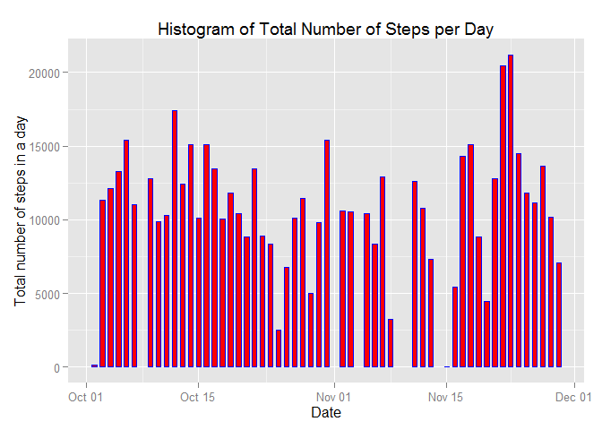
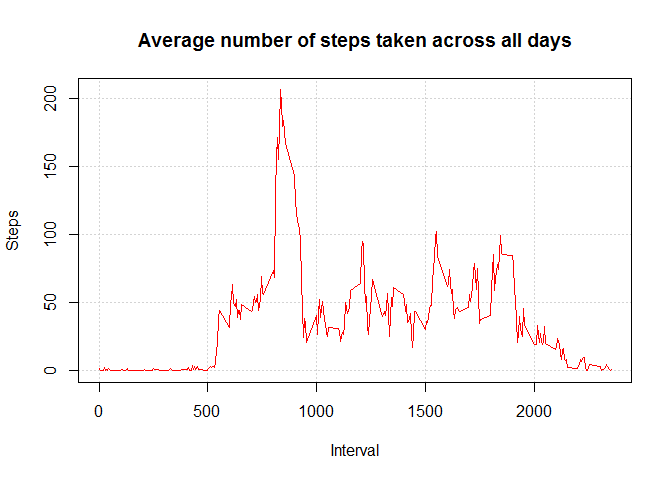
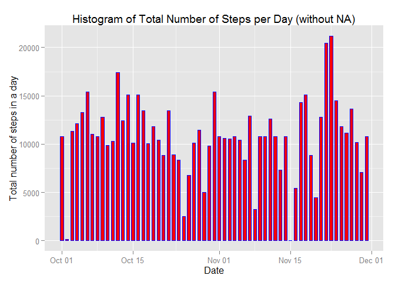

# Reproducible Research: Peer Assessment 1: Report on a personal activity monitoring device data

```r
library(ggplot2)
library(lattice)
```

##  Loading and preprocessing the data
###`1. Show any code that is needed to

###Load the data (i.e. read.csv())

```r
##NOTE: The GitHub repository also contains the dataset for the assignment so we do not have 
##to download the data separately.
##Hence Code for Downloading data is not required
##First create a Data Directory if it is not already exists
##Data directory will be used to store Unzipped File
if(!file.exists("./data")){dir.create("./data")}

##Data is a ZIP archive
#Hence unzip the file
if(!file.exists("./activity.csv"))
{  unzip(zipfile = "activity.zip",exdir = "./data")  
}

##A. Loading and preprocessing the data

##1. Load the data (i.e. read.csv())

dt <- read.csv("data/activity.csv")
```
### Process/transform the data (if necessary) into a format suitable for your analysis

```r
##Convert  date field to date Type

dt$date <- as.Date(dt$date, format = "%Y-%m-%d")
```

## What is mean total number of steps taken per day?
NOTE : For this part of the assignment, missing values in the dataset can be ignored.

### 1.Calculate the total number of steps taken per day


```r
##Aggregate with Function  Sum 
dataTotalStepsPerDay <- aggregate(steps ~ date, FUN=sum, data=dt)

##Display first 15 records. 
head(dataTotalStepsPerDay,15)
```

```
##          date steps
## 1  2012-10-02   126
## 2  2012-10-03 11352
## 3  2012-10-04 12116
## 4  2012-10-05 13294
## 5  2012-10-06 15420
## 6  2012-10-07 11015
## 7  2012-10-09 12811
## 8  2012-10-10  9900
## 9  2012-10-11 10304
## 10 2012-10-12 17382
## 11 2012-10-13 12426
## 12 2012-10-14 15098
## 13 2012-10-15 10139
## 14 2012-10-16 15084
## 15 2012-10-17 13452
```

```r
## Full result can be viewed by typing
##dataTotalStepsPerDay
```
###2. If you do not understand the difference between a histogram and a barplot, research the difference between them. Make a histogram of the total number of steps taken **each day** (emphasis added)
With bar charts, each column represents a group defined by a categorical variable; and with histograms, each column represents a group defined by a quantitative variable. [Source](http://stattrek.com/statistics/charts/histogram.aspx?Tutorial=AP)

```r
##Make a histogram of the total number of steps taken each day

ggplot(dataTotalStepsPerDay, aes(date, steps)) + geom_bar(stat = "identity", colour = "blue", fill = "red", width = 0.6)+  labs(title = "Histogram of Total Number of Steps per Day", x = "Date", y = "Total number of steps in a day")
```

 

```r
##plot(dataTotalStepsPerDay$date, dataTotalStepsPerDay$steps, type="h", main="Histogram of Total Number of Steps per Day",xlab="Date", ylab="Steps per Day", col="blue", lwd=7)
```
### 3.Calculate and report the mean and median of the total number of steps taken per day

```r
##mean
mn=mean(dataTotalStepsPerDay$steps)
mn
```

```
## [1] 10766.19
```

```r
##median
md=median(dataTotalStepsPerDay$steps)
md
```

```
## [1] 10765
```

```r
##
##However the easiest way is to sumarry the data
summary(dataTotalStepsPerDay)
```

```
##       date                steps      
##  Min.   :2012-10-02   Min.   :   41  
##  1st Qu.:2012-10-16   1st Qu.: 8841  
##  Median :2012-10-29   Median :10765  
##  Mean   :2012-10-30   Mean   :10766  
##  3rd Qu.:2012-11-16   3rd Qu.:13294  
##  Max.   :2012-11-29   Max.   :21194
```
## What is the average daily activity pattern?
### 1.Make a time series plot (i.e. type = "l") of the 5-minute interval (x-axis) and the average number of steps taken, averaged across all days (y-axis)

```r
## First Calculate Average Number of Steps 
dataAvgNoSteps <- aggregate(steps ~ interval, FUN=mean, data=dt)

## X axis - Interval field contains 5 minutes interval data, so no special step is required
## Y Axis - steps field contains average number of steps taken

plot(x=dataAvgNoSteps$interval, y=dataAvgNoSteps$steps, type="l", main="Average number of steps taken across all days", col=2, xlab="Interval", ylab="Steps",panel.first=grid())
```

 


### 2. Which 5-minute interval, on average across all the days in the dataset, contains the maximum number of steps?

```r
# Display the row  of dataAvgNoSteps which contains max of steps
## which.max - Determines the location, i.e., index of the (first)  maximum of a numeric (or logical) vector
## Filter out that row with all columns and assign to a variable

maxAvgSteps <- dataAvgNoSteps[which.max(dataAvgNoSteps$steps),]
maxAvgSteps 
```

```
##     interval    steps
## 104      835 206.1698
```

## Imputing missing values
Note that there are a number of days/intervals where there are missing values (coded as NA). The presence of missing days may introduce bias into some calculations or summaries of the data.

### 1. Calculate and report the total number of missing values in the dataset (i.e. the total number of rows with NAs)

```r
##length(which(is.na(dt)))

cat("Total number of missing values in the dataset =",length(which(is.na(dt))))
```

```
## Total number of missing values in the dataset = 2304
```
###2. Devise a strategy for filling in all of the missing values in the dataset. The strategy does not need to be sophisticated. For example, you could use the mean/median for that day, or the mean for that 5-minute interval, etc.

**_A simple strategy would be to find out NA for an interval and replace it with the average number of steps for that interval_**

### 3.Create a new dataset that is equal to the original dataset but with the missing data filled in.

```r
##Create a New data set for data witout NA
dtWithOutMsng <- dt
for (i in 1:nrow(dtWithOutMsng)) {
  if (is.na(dtWithOutMsng$steps[i])) 
    ## Find interval value corresponding to that NA
    {
    intrvl <- dtWithOutMsng$interval[i]
    ## get the mean for that interval
    stps <- dataAvgNoSteps[dataAvgNoSteps$interval == intrvl,]
    ##Replace NA with mean
    dtWithOutMsng$steps[i] <- stps$steps
  }
}
##Check whether missing valu exists
length(which(is.na(dtWithOutMsng)))
```

```
## [1] 0
```
### 4.Make a histogram of the total number of steps taken each day and Calculate and report the mean and median total number of steps taken per day. Do these values differ from the estimates from the first part of the assignment? What is the impact of imputing missing data on the estimates of the total daily number of steps?

```r
## First aggregate data without missing value on steps
dtWithOutMsngSum <- aggregate(steps ~ date, dtWithOutMsng , sum)
##Make a histogram of the total number of steps taken each day
ggplot(dtWithOutMsngSum , aes(date, steps)) + geom_bar(stat = "identity", colour = "blue", fill = "red", width = 0.6)+  labs(title = "Histogram of Total Number of Steps per Day (without NA)", x = "Date", y = "Total number of steps in a day")
```

 

```r
##Compare mean and median for data with NA and without NA
sprintf("The Mean of steps taken per day [with NA] =%f and the Mean of  steps taken per day [with out NA] = %f. The difference is = %f ",mean(dataTotalStepsPerDay$steps), mean(dtWithOutMsngSum$steps),mean(dataTotalStepsPerDay$steps)-mean(dtWithOutMsngSum$steps))
```

```
## [1] "The Mean of steps taken per day [with NA] =10766.188679 and the Mean of  steps taken per day [with out NA] = 10766.188679. The difference is = 0.000000 "
```

```r
sprintf("The Median of steps taken per day [with NA] =%f and Median of steps taken per day [with out NA]= %f.The difference is= %f  ",median(dataTotalStepsPerDay$steps), median(dtWithOutMsngSum$steps),median(dataTotalStepsPerDay$steps)-median(dtWithOutMsngSum$steps))
```

```
## [1] "The Median of steps taken per day [with NA] =10765.000000 and Median of steps taken per day [with out NA]= 10766.188679.The difference is= -1.188679  "
```
**_There is not much difference in the result for mean of the dataset owever the meadian now has shifted a little with input of the missing value._**
## Are there differences in activity patterns between weekdays and weekends?
For this part the weekdays() function may be of some help here. Use the dataset with the filled-in missing values for this part.

### 1. Create a new factor variable in the dataset with two levels - **"weekday"** and **"weekend"** indicating whether a given date is a weekday or weekend day.

```r
## Create a new variable weekdays in the data
##weekdays function return day of the week
## if date is  Saturday or sunday set the label  as weekend else set  label as  weekday

dtWithOutMsng$weekdays <- as.factor(ifelse(weekdays(dtWithOutMsng$date) %in% c("Saturday","Sunday"),"weekend", "weekday"))
##Now we have only two labels in th field weekdays
levels(dtWithOutMsng$weekdays)
```

```
## [1] "weekday" "weekend"
```
### 2. Make a panel plot containing a time series plot (i.e. type = "l") of the 5-minute interval (x-axis) and the average number of steps taken, averaged across all weekday days or weekend days (y-axis). See the README file in the GitHub repository to see an example of what this plot should look like using simulated data.

```r
# calculate average steps by interval across all days
aggrdtWithOutMsng <- aggregate(steps ~ interval + weekdays , dtWithOutMsng, FUN = "mean")

##Now draw a plot
##Important Concept - Conditioning in Lattice Graphics
## Conditioning, allows us to view relationships across "panels" with common scales. Each panel contains a plot 
## whose data is  "conditional" upon records drawn from the category that supports that particular panel 

##The "aggrdtWithOutMsng$steps ~ aggrdtWithOutMsng$interval part of the call to xyplot represents 
## the formula where steps represents the y-axis and interval represents the x-axis.
## Conditioning variable which is typically a category/factor is represened after "|". It also let's us
## know that the resulting plot will contain a number of panels the number of which will correspond to
##the number of unique values assumed by the conditioning variable. In the case of  aggrdtWithOutMsng$weekdays  
## this will be two  since the unique values assumed by weekdays are weekday and Weekend.

xyplot(aggrdtWithOutMsng$steps ~ aggrdtWithOutMsng$interval | aggrdtWithOutMsng$weekdays, 
       layout = c(1, 2), type = "l", 
       xlab = "Interval", ylab = "Average Number of Steps")
```

 
